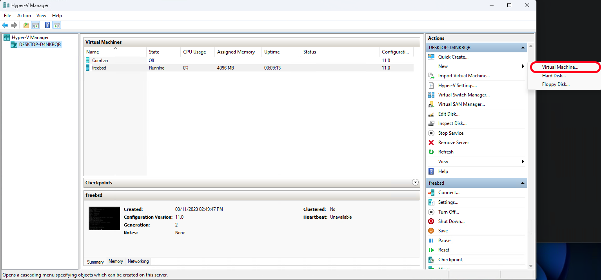
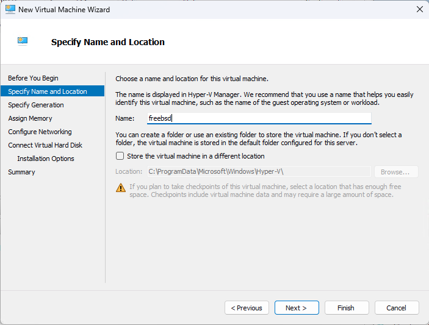
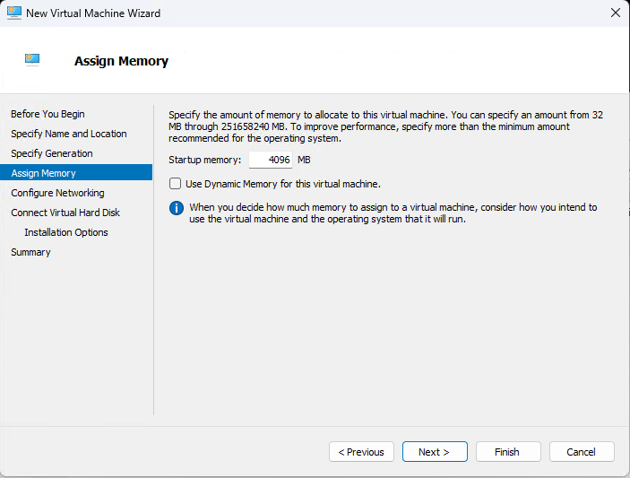
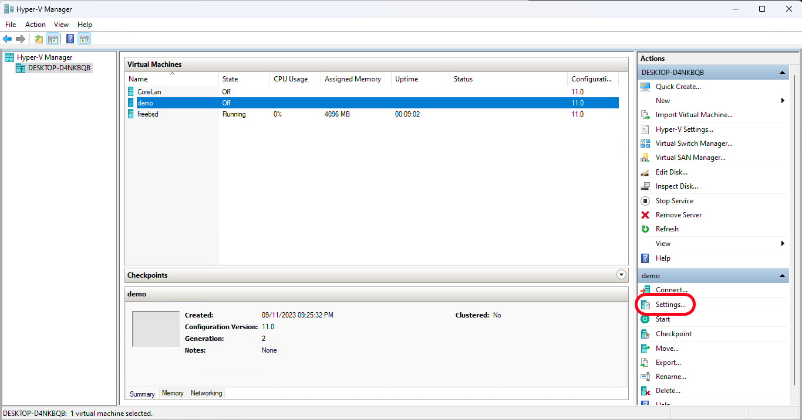

VM Setup on Windows without paying for virtualization software

* auto-gen TOC:
{:toc}

## Requirements

In order to use Hyper-V, you need to be running Windows 10 or Windows 11 in Pro, Enterprise, or Education forms. If you are using Windows Home (10 or 11), you need to upgrade your license to one of the higher tiers. "But that costs money!" you say? Normally. But not for you!

Go to the [Microsoft Software for Students](https://cat.pdx.edu/services/software/users/microsoft-software/) page, and follow the instructions for obtaining an account on the Azure Portal. Once you have access, you can obtain a new license key for Windows 10 or 11 Education, allowing you to use Hyper-V.


I would strongly encourage you to move to Windows 11, but that's ultimately your decision.

The commands below will install some useful tooling and then enable the Hyper-V features you need. You'll need to reboot after running it, but once you do, you'll be ready to go! If you decide to run everything in a single go, make sure to edit the script to remove the `❯` character.

```powershell
❯ Set-ExecutionPolicy Bypass -Scope Process -Force; [System.Net.ServicePointManager]::SecurityProtocol = [System.Net.ServicePointManager]::SecurityProtocol -bor 3072; Invoke-Expression ((New-Object System.Net.WebClient).DownloadString('https://community.chocolatey.org/install.ps1'))
❯ Set-ExecutionPolicy -ExecutionPolicy RemoteSigned
❯ refreshenv
❯ #feel free to edit the below to only install the parts you want
❯ choco install -y 7zip notepadplusplus chocolatey-core.extension powershell-core git microsoft-windows-terminal terminal-icons.powershell nerdfont-hack inconsolata firanf powertoys vscode 
❯ # The below installs texlive if you want a more unix-like tex install
❯ choco install -y texlive --params "'/scheme:full'"
❯  # The below is to setup the PowerShell prompt to be more useful to you
❯ Install-Module -Name ImportExcel
❯ Install-Module -Name Pansies -AllowClobber
❯ Install-Module -Name Pscx -AllowPrerelease
❯ Install-Module -Name PowerColorLS
❯ Install-Module -Name Posh-Git
❯ Install-Module -Name PSReadLine -AllowPrerelease -Force
❯ # This may or may not work on the version of windows you have installed:
❯ winget install JanDeDobbeleer.OhMyPosh 
❯ # if the above failed, install https://www.microsoft.com/en-us/p/app-installer/9nblggh4nns1?rtc=1&activetab=pivot:overviewtab and try again
❯ if (!((Get-WindowsOptionalFeature -online -FeatureName Microsoft-Hyper-V).State -eq 'Enabled')) {
  Enable-WindowsOptionalFeature -online -FeatureName Microsoft-Hyper-V -All -NoRestart
}
❯ if (!((Get-WindowsOptionalFeature -online -FeatureName VirtualMachinePlatform).State -eq 'Enabled')) {
  Enable-WindowsOptionalFeature -online -FeatureName VirtualMachinePlatform -All -NoRestart
}
❯ if (!((Get-WindowsOptionalFeature -online -FeatureName HypervisorPlatform).State -eq 'Enabled')) {
  Enable-WindowsOptionalFeature -online -FeatureName HypervisorPlatform -All -NoRestart
}
```

## Hyper-V Switch Setup

To create an internal network with Hyper-V, you need to create a virtual switch. This is a virtual network interface that you can attach to your VMs. You can create multiple switches, and attach multiple VMs to each switch. This allows you to create multiple networks, and to isolate them from each other. Alternatively, you can have an internal network that is shared between VMs, and then a gateway (or bastion host) between that bridges the two switches.

While we could use PowerShell to do this, we'll start with Hyper-V Manager. We'll get to the PS way of doing this later in the course. To create a switch, select "Virtual Switch Manager" under "Actions" on the right side of Hyper-V Manager.


Then, select "New virtual network switch" and "Internal" as the type. Click "Create Virtual Switch".


Give your switch a name, then hit "OK." You now have your internal network switch!

## VM Installation, Step by Step

1. Download your image:

   ```powershell
   ❯ # xz for windows is a cluster, so just pull down the ISO directly. It's not that big.
   ❯ Invoke-WebRequest -Uri "https://download.freebsd.org/ftp/releases/ISO-IMAGES/13.2/FreeBSD-13.2-RELEASE-amd64-dvd1.iso" -OutFile "FreeBSD-13.2-RELEASE-amd64-dvd1.iso"
   ```

1. Checksum your image:

   ```powershell
   ❯ Get-FileHash -Algorithm SHA512 -Path .\FreeBSD-13.2-RELEASE-amd64-dvd1.iso | Format-List
   
      Algorithm : SHA512
      Hash      : 7C5473B9BBC5CB235329B8FA17FFB690ABBAE67FE5E4BB30260BAA034501D3F23EBA82679A9871AF2F42E9600AFF7E9E810A0B03005AFC24962ED03945171AE1
      Path      : D:\FreeBSD-13.2-RELEASE-amd64-dvd1.iso

   ```

1. Create a new VM in Hyper-V by selection "New" and "Virtual Machine" from the right side of the Hyper-V Manager window.

    

1. Give it a name (and possibly change the storage location if necessary), then click "Next".

    

1. Select "Generation 2" for the generation of the VM. Click "Next".

    

1. Assign at least 4096 MB of memory to the VM. Click "Next".

    

1. Set "Connection:" to "Default Switch". Click "Next".

    

1. Create a new virtual hard disk, and set the size to 64GB. Click "Next".

    

1. Select "Install an operating system from a bootable image file" and browse to the ISO you downloaded. Click "Next".

    

1. At the summary screen, click "Finish".

1. Before launching the VM, click on "Settings" on the right side of the Hyper-V Manager window.

    

    Click "Add Hardware" and select "Network Adapter". Click "Add". On this next screen, select the switch you created previously. Click "Apply".

    Click "Security" and uncheck the box for "Enable Secure Boot". Click "Apply".

    At this point, your settings should look something like this:

    

    Click "OK". Now run the VM.

1. Once the VM boots, you'll be presented with a menu. Just hit enter. Most of the defaults are what you want them to be. Some specific things to look out for:

   * The default keyboard layout is US. If you want something else, you'll need to select it.
   * Pick a hostname that you can live with.
   * You want to use Auto (ZFS) Guided Root-on-ZFS for your disk configuration.
     * On the next screen, hit T, then Enter to select your disks. You want Stripe, so hit Enter again. Hit spacebar to select the disks, then Enter to continue.
     * Hit up to select ">>> Install", then hit Enter.
   * Enter a root password ***and remember it!*** Store it securely, preferably in a password manager.
   * Setup "hn0" to use DHCP. IPv6 isn't necessary.
   * For Timezone selection, you want option 2, then option 49 (hit 5 twice then up arrow), then option 21 (hit 2 twice then down arrow). This assumes you want to use US Pacific Time. If you want something else, you'll need to figure out the appropriate option.

Once you have the freeBSD machine up and running, you can use [this script](freebsd_setup.sh.md) to do most of what we get from pfSense. Before running it, execute the below commands:

```sh
$ sed -i '' 's/WAN="hn0"/WAN="vtnet0"/g' freebsd_setup.sh
$ sed -i '' 's/LAN="hn1"/LAN="vtnet1"/g' freebsd_setup.sh
```

You didn't think I was actually going to make you do all of that by hand, did you? That's just cruel. And part of what you get to do if you take my network security class. So, you know, you can do it then. But not now. Now, you get to use the script. And you'll be happy about it.

There's one caveat to the above. If you *really* don't want to use NAT on the VM, you could instead create another network switch in external mode and bridge it to a physical NIC on your PC. This is useful in situations where you want the VM to be a networking peer to your host system, but since you likely don't have multiple physical NICs on your laptop, we aren't really going to cover this much in practice. I will be talking about it in class, though.

## Ubuntu 22.04 VM Installation

With the above VM instructions, you should be able to install any additional VMs that you need. In our case, we want to use an Ubuntu 22.04 VM to run our tools and services. So, let's do that.

Snag the [Ubuntu Server for AMD64](https://cdimage.ubuntu.com/releases/22.04/release/ubuntu-22.04.3-live-server-amd64.iso) ISO. Make sure to verify the checksums!

Once you have the ISO downloaded, create a new VM and install Ubuntu. The only setting within the VM configuration you need to worry about is to change the Network Mode to "Host Only" on the single NIC you need for this VM. This will allow the Ubuntu VM to use the FreeBSD VM as its gateway to the outside world. You can then use the FreeBSD VM as a bastion host to access the Ubuntu VM.