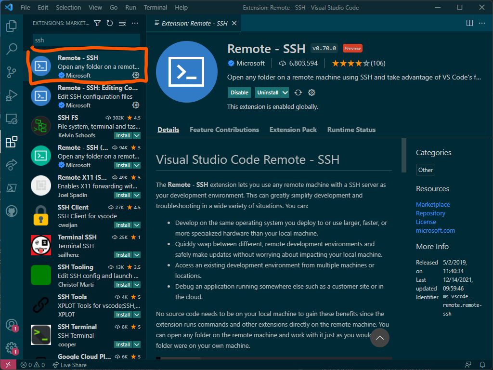
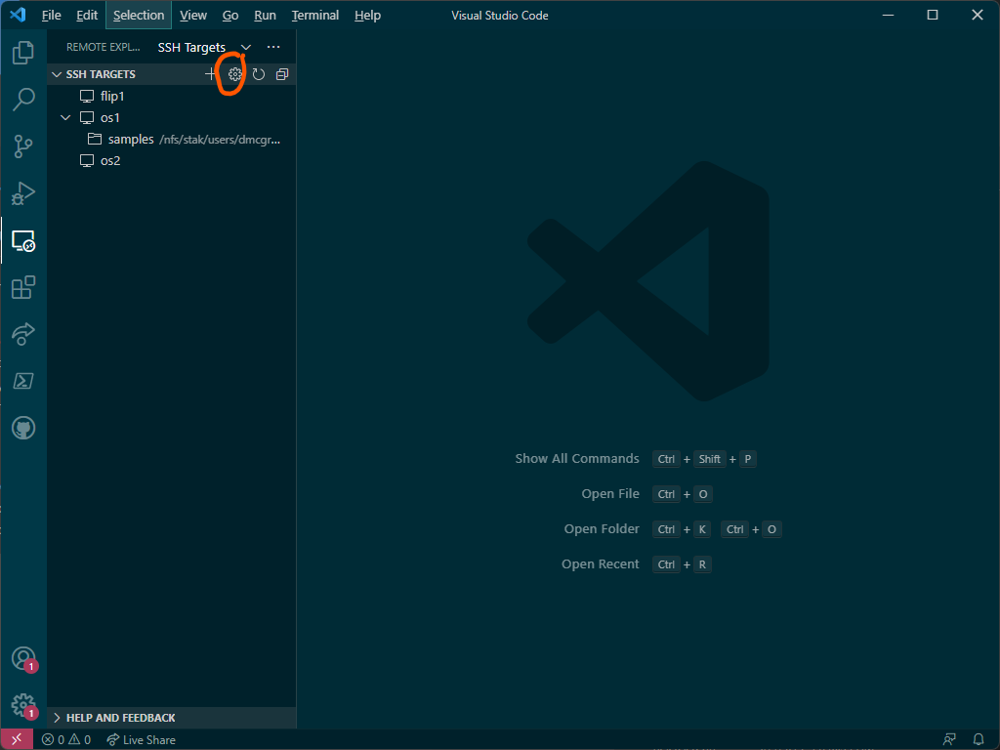
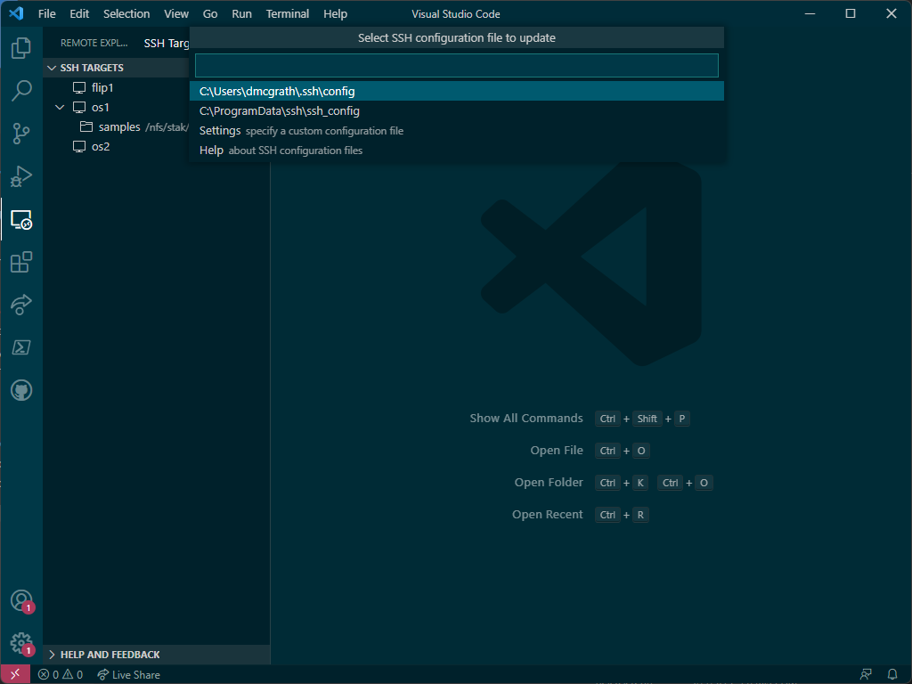
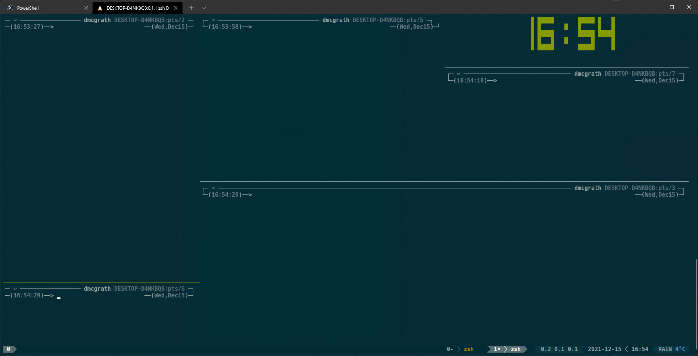
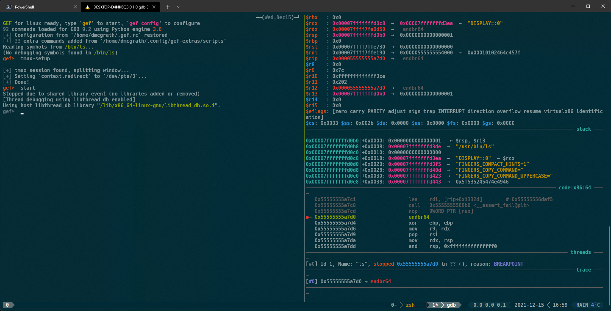

# Software configuration that might be useful

* auto-gen TOC:
{:toc}

***AR: ensure you can connect to the server!***

For this class, we will be using a specific server -- [linux.cs.pdx.edu](ssh://linux.cs.pdx.edu) (the previous link uses the ssh:// scheme -- your browser may not support it). To access it, you will need to use some form of SSH client. The actual hostname of this server is `ada`. Login details are provided by the College IT. If you haven't created your account yet, please contact IT Support.

Each OS has the ability to make use of a terminal-type program. Each will be discussed a bit in the below sections, but the only variance is the actual name of the tool used. In all cases, you will be editing code (somewhere), but compiling and running on `ada`. In all cases below, the command within the specific terminal emulator you are using should look something like (replace the "\<MCECS username>" with your actual MCECS username (not your ODIN!).

```zsh
$ ssh linux.cs.pdx.edu -l <MCECS username>
```

When we get to the VScode discussion, I will explain how to use the ssh config file to create bookmarks with specific configurations.

---
## SSH key generation

If you don't already have an SSH key, please see the below links for how to generate and distribute the key files. These are links to the MS documentation, but the instructions are the same on every OS -- these are standard tools.

### [User key generation](https://docs.microsoft.com/en-us/windows-server/administration/openssh/openssh_keymanagement#user-key-generation)
---

Generating an ssh key is a relatively painless process. This can be run either locally or on the server. If you are running it locally, you will need to copy the public key to the server. If you are running it on the server, you will need to copy the private key to your local machine. `$` is the prompt character, don't type it.

```zsh
$ ssh-keygen -t ed25519
```
By itself, the above command will prompt you for some information, including a (highly encouraged but technically optional) passphrase for the key. If you want to automate the process, you can add the `-f` flag to specify the filename, and the `-N` flag to specify the passphrase. The below command will generate a keypair with no passphrase, and save it to the default location.

```zsh
$ ssh-keygen -t ed25519 -f ~/.ssh/id_ed25519 -N ""
```

Once you have the keypair generated, it's time to move things to destination locations. Depending on where you generated the key, you'll need one of the two sections below.

### [Getting public key to server](https://docs.microsoft.com/en-us/windows-server/administration/openssh/openssh_keymanagement#standard-user)
---

If you generated the key on your local machine, you need to somehow copy it to `~/.ssh/authorized_keys` *on the server*. This can be accomplished by running:

```zsh
$ cat ~/.ssh/ed_25519.pub | ssh linux.cs.pdx.edu 'cat >> ~/.ssh/authorized_keys'
```

This will append the new public key to the `~/.ssh/authorized_keys` file on the server, so that any previous keys aren't overwritten.

### Getting private key to local machine
---

Before we get the private key to our local machine, we need to add our public key to the `~/.ssh/authorized_keys` file.

```zsh
$ cat ~/.ssh/id_ed25519.pub >> ~/.ssh/authorized_keys
```

Then, we make use of whatever file transfer protocol we prefer to copy `~/.ssh/id_ed25519` to our local machine. You can use filezile, winscp, cyberduck, etc. to move the file to `~/.ssh/id_ed25519` *on your local system*. This can be done via drag and drop, or by using PowerShell/Terminal.app, depending on your platform.

### `ssh-agent`
---

If you did the security-conscious thing and set a passphrase on your key, that can get really annoying to enter all the time. Meet [`ssh-agent`](https://www.ssh.com/academy/ssh/agent).

This will allow us to use the key without having to type the passphrase every time we want to use it. This is a security risk, but it's a tradeoff between security and convenience. If you are using a passphrase, you will need to type it once per session, and then you can use the key without having to type it again. If you are not using a passphrase, you will not need to type anything.

On macOS, ssh-agent uses the system keychain. Run `ssh-add --apple-use-keychain ~/.ssh/id_ed25519`, enter your passphrase, and never think about it again.

On Windows, this is a little more complex. You'll need both an admin PowerShell window and a normal PowerShell window. In the admin shell, execute the following:

```powershell
pwsh❯ # By default the ssh-agent service is disabled. Allow it to be manually started for the next step to work.
pwsh❯ # Make sure you're running as an Administrator.'
pwsh❯ Get-Service ssh-agent | Set-Service -StartupType Manual
pwsh❯ 
pwsh❯ # Start the service
pwsh❯ Start-Service ssh-agent
pwsh❯ 
pwsh❯ # This should return a status of Running
pwsh❯ Get-Service ssh-agent

Status   Name               DisplayName
------   ----               -----------
Running  ssh-agent          OpenSSH Authentication Agent
```

And then in the user powershell, run `ssh-add ~\.ssh\id_ed25519`, enter your passphrase, and never think about it again.

---
## Configuring Windows
---
***AR: If on windows, configure PowerShell OR get WSL2 up and running!***

I would suggest you install the following:

- [Chocolatey](https://chocolatey.org/) - a Windows package manager -- lets you install so many things: 
  - Python, 
  - all of the below tools, 
  - VSCode, etc. 
  - And it's scriptable! It makes moving to a new machine so easy. 
- `winget` is a brand new alternative direct from MS. Your choice. I generally only use it for one tool (WinDbg) at this point but eventually could see myself switching to it full-time. At least, if it gets all the packages I want. The below four are included in `winget` repos.

- Windows Terminal - a tabbed interface to a modern console application (`choco install microsoft-windows-terminal`)
- Cross-Platform PowerShell - an updated pwsh instance, provides full .NET access from the command line (`choco install powershell-core`)
- VSCode (`choco install visualstudiocode`)
- Powertoys - a handy little collection of utilities (strictly optional but strongly recommended, mostly for the FancyZones tool) (`choco install powertoys`)

***AR: If on windows, get WSL2 up and running or a fully configured PowerShell!***

If you're on Windows and haven't already done so, I would strongly encourage you to install Windows Subsystem for Linux (version 2), then install Ubuntu (or whatever your preferred distribution is).

This will provide you with a package manager and an enhanced PowerShell. Running the below commands (each starts with ❯, do not copy that character) in an admin level PowerShell (search for PowerShell in your start menu, right-click, and select Run As Administrator):

```powershell
❯ Set-ExecutionPolicy Bypass -Scope Process -Force; [System.Net.ServicePointManager]::SecurityProtocol = [System.Net.ServicePointManager]::SecurityProtocol -bor 3072; Invoke-Expression ((New-Object System.Net.WebClient).DownloadString('https://community.chocolatey.org/install.ps1'))
❯ Set-ExecutionPolicy -ExecutionPolicy RemoteSigned
❯ refreshenv
❯ #feel free to edit the below to only install the parts you want
❯ choco install -y 7zip notepadplusplus chocolatey-core.extension powershell-core git microsoft-windows-terminal terminal-icons.powershell nerdfont-hack inconsolata firanf powertoys vscode 
❯ # The below installs texlive if you want a more unix-like tex install
❯ choco install -y texlive --params "'/scheme:full'"
❯ # The below installs miktex if you want a smaller install and a more windows-like tex install
❯ choco install -y miktex
❯  # The below is to setup the PowerShell prompt to be more useful to you
❯ Install-Module -Name ImportExcel
❯ Install-Module -Name Pansies -AllowClobber
❯ Install-Module -Name Pscx -AllowPrerelease
❯ Install-Module -Name PowerColorLS
❯ Install-Module -Name Posh-Git
❯ Install-Module -Name PSReadLine -AllowPrerelease -Force
❯ # This may or may not work on the version of windows you have installed:
❯ winget install JanDeDobbeleer.OhMyPosh 
❯ # if the above failed, install https://www.microsoft.com/en-us/p/app-installer/9nblggh4nns1?rtc=1&activetab=pivot:overviewtab and try again


❯ # The above commands will enable powershell, while the below commands will set up and configure WSL. Only pick the WSL option if you have an active interest


❯ # in using WSL for your development. If you don't know what WSL is, you probably don't want to use it.
❯ Write-Host "Enabling WSL features..."
❯ if (!((Get-WindowsOptionalFeature -online -FeatureName Microsoft-Windows-Subsystem-Linux).State -eq 'Enabled')) {
    Enable-WindowsOptionalFeature -online -FeatureName Microsoft-Windows-Subsystem-Linux -All -NoRestart
}
❯ #a reboot will be required if you didn't already have WSL installed
❯ #install wsl2 with ubuntu-20.04, update it, and then install useful/necessary tools for xv6 development
❯ wsl --install --distribution Ubuntu-22.04
❯ #lauch wsl at least once to initialize it and set username and password
❯ wsl
❯ #after configuration is complete, run the below commands in WSL ($ is the prompt, don't copy it) 
$ sudo apt update
$ sudo apt upgrade
$ sudo apt install texlive-full build-essential bat tmux zsh git build-essential gdb-multiarch qemu-system-misc gcc-riscv64-linux-gnu binutils-riscv64-linux-gnu 
$ gem install colorls
$ #add alias for colorls to your startup script:
$ echo "alias less=bat" >> $HOME/.$(basename $SHELL)rc
$ echo 'alias ls="colorls --gs"' >> $HOME/.$(basename $SHELL)rc
```

To configure your PowerShell to do what you'll need for command-line access, see below, adding the contents to your $PROFILE file. If you have VScode installed, you can edit this file easily from PowerShell by running `code $PROFILE`, which will create the file if it doesn't already exist.

[***PowerShell Profile***](powershell_profile.md)

---
## macOS Setup


macOS has an inbuilt application (in /Applications/Utilities/) called Terminal.app. I'd suggest installing Brew to get a solid package manager. As a note, if you don't already have the command line utilities from Xcode installed, the command to install Brew can take a while and look totally stuck. This is because if you've never opened Xcode before, it is trying to get you to accept a license -- which it doesn't show you. I've broken that out as a specific call as an edit to this page. This also requires that you have Xcode installed, which I admit I assumed was the case.

From Terminal.app, run

```zsh
$ xcode-select --install
$ /bin/bash -c "$(curl -fsSL https://raw.githubusercontent.com/Homebrew/install/HEAD/install.sh)"
$ brew install --cask visual-studio-code
$ brew tap homebrew/cask-fonts
$ brew install --cask font-hack-nerd-font
$ brew tap caskroom/fonts
$ brew install --cask font-fira-code font-fira-mono font-fira-mono-for-powerline font-fira-sans
$ brew install texlive #this is for the technical writing portion, but useful to take care of now
```

---

## Linux Setup

Linux has a variety of terminal emulators. I would recommend one of Konsole, Gnome Terminal, or RXVT. I will be assuming you are either running a Debian-based distribution (such as Ubuntu or Kali), or you know enough about your distribution that you can handle the installs.

```zsh
$ sudo apt update
$ sudo apt upgrade
$ sudo apt install fonts-firacode fonts-inconsolata git gdb-multiarch texlive-full build-essential
$ curl -o vscode.deb -L https://go.microsoft.com/fwlink/\?LinkID\=760868
$ sudo apt install ./vscode.deb
```

The above are the package names for Ubuntu. If you are using a different distribution, some hints are below:

[VScode install instructions](https://code.visualstudio.com/docs/setup/linux)

`apt search <name>` to find packages in `apt` based distributions.

---
## Remote Editing in VSCode
---

TODO: add link to video

The following consists of the same steps for those who prefer a written description. In other words, you don't have to watch the video if you read and follow these instructions or vice versa. We all learn differently.

After installing VScode, you'll need to install some extensions. I'm explicitly detailing the SSH Remote extension here.

Go to the Extensions tab:


Search for (and install) the SSH Remote extension:


You will see a new tab in the left toolbar with the name Remote Explorer, which you should select: 


This opens a window with any configured hosts -- you can see a few of mine. Select the gear icon to configure ssh: 


Click the above will show this menu: 


You want the first option, the config file in your home directory (this is true regardless of platform). Please ensure the contents below are added to this file:

```sh
Host ada 
    Hostname linux.cs.pdx.edu 

Host *
    #don't require calling ssh-add to use the agent
    AddKeysToAgent yes
    #macOS has a UseKeychain option, but not every OS does
    IgnoreUnknown UseKeychain
    UseKeychain yes
    #default to forwarding X11
    ForwardX11Trusted yes
    #set default username -- ***CHANGE THIS TO YOUR USERNAME***
    User your_user_name_here
    #This assumes you followed the instructions above
    IdentityFile ~.ssh/id_ed25519
    #keep connection alive every 30 seconds
    ServerAliveInterval 30
    #don't allow for more than 3 consecutive missed keepalives
    ServerAliveCountMax 3
``` 

VScode Extensions
Ultimately, which extensions you find useful will be a very personal decision. That said, here are the extensions that I find useful:

|---|---|---|
| Extension name | Use | Install Command|
| Remote-ssh|Remote editing on server|`code --install-extension ms-vscode-remote.remote-ssh`
C/C++ Extension Pack|Recommended tools for C/C++ programming|`code --install-extension ms-vscode.cpptools-extension-pack`
C/C++ Themes|Better syntax highlighting|`code --install-extension ms-vscode.cpptools-themes`
Code Spell Checker|Code-aware spell checking|`code --install-extension streetsidesoftware.code-spell-checker`
GitHub Codespaces|Remote editing directly within GitHub repo|`code --install-extension github.codespaces`
GitHub Copilot|AI pair programming buddy (requires license) |`code --install-extension github.copilot`
GitLens|Git helper|`code --install-extension eamodio.gitlens`
LiveShare|Remote collaborative programming|`code --install-extension ms-vsliveshare.vsliveshare`
The Netwide Assembler (NASM) |nasm syntax highlighting| `code --install-extension rights.nas-vscode`
Workshop|LaTeX support for VScode| `code --install-extension james-yu.latex-workshop`
Utilities|Add-ons for  Workshop| `code --install-extension tecosaur.latex-utilities`
Markdown All in One|Markdown additions for VScode| `code --install-extension yzhang.markdown-all-in-one`
 | | |
 
Not all of these are necessary. I have limited the above list to only those extensions that probably pertain to this class -- there are also many themes, support for myriad languages, and a whole host of other utilities. The last 3 on the list are only if you use `Markdown` or `LaTeX`.

---
## Using tmux
`tmux` is a later generation terminal multiplexer. In the beginning, there was `SCREEN` (yes, all caps). `SCREEN` was great -- you could access serial terminals, you could split your windows, you could have a persistent terminal session that could survive a flaky connection. For what it was, in the time it was, `SCREEN` was awesome. But we often just needed a little more than `SCREEN` could provide. Thus, `tmux` was born!

`tmux` takes everything SCREEN provided, then adds a plugin architecture to enable significant extensibility. Think of `tmux` as a provider of virtual desktops, but instead of GUI desktops, it is sets of terminal interfaces. Much like SCREEN, `tmux` uses a chorded interface. This means some particular key combination initiates command mode, and then a follow-up keystroke (or set of strokes) performs some functionality. Visual Studio and VSCode are also chorded, as is emacs (vim uses an entirely different modal approach). The default chord key is ctrl + b. Some features of `tmux`:

- Arbitrary splits (chord key + - or |): 


- Extensible status bar -- see bottom of the above image. This is making use of PowerLineLinks to an external site.
- Compatibility with tools such as GDB 

There are many additional benefits to `tmux`. If nothing else, the ability to resume where you left off after a network hiccup is invaluable.

```sh
> tmux ls #get the list of clients
> tmux switchc -t <x> #where <x> is replaced by the terminal number you want
```
Some terminology that might be useful:

- A pane in `tmux` contains a shell with which you interact.
- A window contains one or more panes, each with its own independent content.
- A session contains one or more windows, each containing one or more panes.

Look at the image above (either one) -- do you notice the numbers in the status bar across the bottom? The left-most (with value 0) is the session number; that is, the value of x I would pass to `tmux switchc -t <x>` to reconnect to this session. The left-most of the right set of values is my window number; in this case, it is window 0 in session 0 and is running zsh. To the right of that is window 1, which is running `gdb`. You might notice that is labeled 1* -- this means it is the currently active window.

So a given instance of `tmux` will be running one or more sessions, each with one or more windows, each with one or more panes. As you can see, you could have an absurd number of things going on in any given terminal window. Your sessions will run indefinitely unless you explicitly kill `tmux` or reboot the computer.

So how might you use this? Well, one way would be to have one session that maintains a remote connection, another session that monitors resources on your Azure/AWS hosts, and another session connected to your local system. All of them running, all of the time, without you having to maintain them or make sure they don't disappear.

Some more good info on `tmux` can be found [here](https://thevaluable.dev/tmux-config-mouseless/).

I have a fairly extensive `tmux` configuration that you're welcome to steal, should you so desire. The contents of my [`.tmux.conf` file](.tmux.conf.md).

Additional help on tmux: 

- [tmux cheatsheet](https://tmuxcheatsheet.com/)
- [Linux Handbook on tmux](https://linuxhandbook.com/tmux/)

---
## Setting up zsh on ada (and likewise WSL/macOS)

I've mentioned zsh several times now, but I haven't really gone over what it is or why it's worth using -- let alone how to make use of it. zsh is a shell, just like bash or tcsh. Much as bash supplanted tcsh as the default shell on macOS, BSD, and many Linux distros, zsh is now supplanting bash. Essentially, it's a more extensible, more secure Bourne-compatible shell (just as bash is Bourne-compatible). It has many benefits, and I strongly encourage its use on ada, macOS, and WSL. 

The files you will need for the configuration I use in the recordings and the screenshots of my terminal can be obtained by running the below script in ada (you got remote editing working in VScode, right? Use that to create the file, call it setup.sh or similar):

```bash
#!/usr/bin/env zsh

#install gef
bash -c "$(curl -fsSL https://gef.blah.cat/sh)"
pip3 install --user keystone-engine ropper capstone unicorn requests

mkdir -p $HOME/bin
mkdir -p $HOME/clones

#install useful additions
#useful little CLI hex viewer
cargo install hexyl

#better pager, called bat
curl -s -L https://github.com/sharkdp/bat/releases/download/v0.23.0/bat-v0.23.0-x86_64-unknown-linux-musl.tar.gz | tar -x -z -C $HOME -f -
mv bat-v0.23.0-x86_64-unknown-linux-musl/bat $HOME/bin/batcat
ln $HOME/bin/batcat $HOME/bin/bat
rm -rf bat-v0.23.0-x86_64-unknown-linux-musl

if [ ! -e $HOME/antigen.zsh ]; then
    curl -L git.io/antigen > $HOME/antigen.zsh
fi

if [ ! -d $HOME/clones/sunwait ]; then
    git clone https://github.com/risacher/sunwait.git $HOME/clones/sunwait
    cd $HOME/clones/sunwait
    make
    cp $HOME/clones/sunwait/sunwait $HOME/bin/sunwait
    cd $HOME
fi

if [ ! -d $HOME/clones/bat-extras ]; then
    git clone https://github.com/eth-p/bat-extras.git $HOME/clones/bat-extras
    cd $HOME/clones/bat-extras
    cp $HOME/clones/bat-extras/bin/* $HOME/bin/
    cd $HOME
fi

if [ ! -d $HOME/clones/tmux-powerline ]; then
    git clone https://github.com/erikw/tmux-powerline.git $HOME/clones/tmux-powerline
fi

if [ ! -d $HOME/clones/diff-so-fancy ]; then
    git clone https://github.com/so-fancy/diff-so-fancy.git $HOME/clones/diff-so-fancy
fi

if [ ! -d $HOME/.tmux/plugins/tpm ]; then
    mkdir -p $HOME/.tmux/plugins/tpm
    git clone https://github.com/tmux-plugins/tpm $HOME/.tmux/plugins/tpm
fi

if [ ! -d $HOME/.oh-my-zsh ]; then
    git clone https://github.com/ohmyzsh/ohmyzsh.git $HOME/.oh-my-zsh
fi

ln -s $HOME/clones/diff-so-fancy $HOME/bin/diff-so-fancy

sed -i 's/alias diff/#alias diff/g' $HOME/.oh_my_zsh/lib/theme-and-appearance.zsh
cd $HOME/.oh-my-zsh/
git add lib/theme-and-appearance.zsh
git commit -m 'unalias diff'
cd $HOME

git config --global user.name "" #fill me in!
git config --global user.email "" #fill me in!
git config --global core.pager "diff-so-fancy | less --tabs=4 -RFX"
git config --global interactive.diffFilter "diff-so-fancy --patch"
git config --global color.ui true
git config --global color.diff-highlight.oldNormal    "red bold"
git config --global color.diff-highlight.oldHighlight "red bold 52"
git config --global color.diff-highlight.newNormal    "green bold"
git config --global color.diff-highlight.newHighlight "green bold 22"
git config --global color.diff.meta       "11"
git config --global color.diff.frag       "magenta bold"
git config --global color.diff.func       "146 bold"
git config --global color.diff.commit     "yellow bold"
git config --global color.diff.old        "red bold"
git config --global color.diff.new        "green bold"
git config --global color.diff.whitespace "red reverse"

chsh -s /bin/zsh

env GEM_HOME=/disk/scratch/$(whoami) 
gem install colorls

#for all classes except 496:
wget -q -O setup.tar.bz2 http://web.cecs.pdx.edu/~dmcgrath/setup.tar.bz2
#for cs496:
#wget -q -O setup.tar.bz2 http://web.cecs.pdx.edu/~dmcgrath/setup_496.tar.bz2
tar xavf setup.tar.bz2 -C ~/
```

You can set up many more things using tmux and/or zsh. For instance, I would recommend installing oh-my-zsh, antigen, and tmuxinator (which I use antigen to install). If you have questions about setting up your shell to be more useful to you, please ask. For reference, my .antigenrc file looks like this:

```sh
antigen use oh-my-zsh
antigen bundle sudo
antigen bundle zsh-interactive-cd
antigen bundle zdharma/fast-syntax-highlighting
antigen bundle zsh-users/zsh-autosuggestions
antigen bundle greymd/docker-zsh-completion
antigen bundle srijanshetty/zsh-pip-completion
antigen bundle git  
antigen bundle tmuxinator
antigen bundle mosh
antigen bundle extract
antigen bundle zsh_reload
antigen bundle psprint/zsnapshot
antigen bundle ael-code/zsh-colored-man-pages
antigen bundle unixorn/autoupdate-antigen.zshplugin
#antigen bundle history-substring-search
# Apply Theme
antigen theme romkatv/powerlevel10k
# Finish
antigen apply
```

Then, in my `~/.zshrc.local` file, I have

```sh
source $HOME/antigen.zsh
antigen init $HOME/.antigenrc
```

Again, if you want your terminal to work better for you, and this doesn't make sense, please ask! I provide these file contents in the setup files I had you download above. These were provided more for folks that don't want to take the easy road, and prefer to have more control over their shell experience.

---
## Using git

Any version control tool is better than no version control tool. See [the page](technical_writing) on Using Git for details regarding the basics of git. Git sucks. Use git.

- [Quick guide to git](http://rogerdudler.github.io/git-guide/)
- [Challenge based approach to understanding git](https://try.github.io/levels/1/challenges/1)


Git is a distributed version control system, originally created by Linus Torvalds in the spirit of BitKeeper (which was proprietary at the time). It is used to track changes to a project's source code, manage the project's history, collaborate with others, and manage releases. As Torvalds once said, he really likes naming things after himself, hence the name `git`.

At its core, the way most people use it is as a variation on `svn`. I mention this to highlight that while git is a distributed version control system, meaning in theory there is no canonical repository, most folks do have a central repository, usually hosted on GitHub or GitLab. There's nothing wrong with this approach at all, but `git` was developed to handle the distributed nature of the Linux kernel development model -- everyone had their own repo that handled their development, then they merged with the 'blessed' repo owned by Torvalds.

These mergers are handled by what are known as *pull requests*, where a developer notifies another developer that a changed or new feature is available for them to merge into their own repo.

Some terminology:

- A repo is a source of information regarding project history and current state of code
- A branch is a logically separate lineage of code which can be merged back in to the 'master' copy (also a branch).
- To get a new copy of a git repo, you `clone` the repository to your own working space.
- You make any changes you'd like, then `commit` them to the local repo.
- At any time, you can `push` all your commits and code to another repo (called the *remote* repo)
- You can also `pull` any changes made to the remote repo and merge them in to your local copy.

One common complaint you may hear about `git` is that "you need to be a plumber in order to go to the bathroom." One of the primary goals of software development is abstraction. As a tool, I shouldn't need to know how it works internally in order to use it. Tools which require that have what is known as a *leaky abstraction*. `git` doesn't have a leaky abstraction -- that would require that it had any abstraction at all. It does not. You must be aware of, to an absurd degree, exactly how `git` works and does what it does in order to use it effectively. It sucks. Use it.

At the network level, `git` supports HTTPs, HTTP, ssh, and its own protocol (the `git://` URI scheme). You do need to know which protocol a given repo is using, as you may need to deal with certificates or SSH keys.

All that said, there's some important things you'll need to know. `git` makes use of significant metadata which define a directory as a repository. Residing in the `$REPO_ROOT/.git/` directory, this metadata is:

```console
.git
├── .git/branches/          # List of branches that exist for the current repository
├── .git/COMMIT_EDITMSG     # Contains the commit message of any uncommitted, but staged content
├── .git/config             # This is the main `git` configuration file. It keeps specific `git` options for your project
├── .git/description        # It will show when you have viewed your repository or the list of all versioned repositories
├── .git/HEAD               # This file holds a reference to the branch (or commit) you currently have checked out 
├── .git/hooks/             # Directory contains shell scripts that are invoked after the corresponding `git` command
├── .git/index              # The `git` index is used as a staging area between your working directory and your repository
├── .git/info/              # Contains additional information about the repository.
├── .git/logs/              # Keeps records of changes made to refs
├── .git/objects/           # In this directory the data of your `git` objects are stored – all the contents of the files you have ever checked i
└── .git/refs/              # This directory normally contains the tips of branches and tags in  three subfolders – heads, remotes and tags
```

It is important to emphasize that `git` tracks content, not files. This means that if two files have the same content, only a single blob will exist in the `.git/objects` tree. This is also true of any identical file trees -- only a single copy of the tree will exist, with the appropriate references to recreate the tree as necessary in the cloned repository. As a corollary, empty directories can't be tracked by `git`.

Only the root of the repository will have a `.git/` folder. Any subdirectories will simply be file trees in the `.git/objects` database. The `.git/objects` database contains 4 distinct types of objects:

- blob: file data
- commit: a snapshot of the whole file system tree rooted at `$REPO_ROOT` 
- tag: specific *named* pointer to a specific commit
- tree: representation of a directory

Each commit is labeled by its SHA1 hash. A commit includes:

- The hash of the root tree 
- The hash of the parent commit(s) 
- Commit message 
- Author 
- Committer 
- Date/time of the commit 

You can have many commits to your local repo, with only a single `push`. All of the commits will be pushed to the remote repo as distinct commits, each with their own copy of the above information.

Depending on your work flow, there may be a single "blessed" repository that is managed by an individual or group, or there may be parallel internal and public repositories (with privileged information redacted from the public repo). There may also be a code review process, using something like Gerrit (a code review system which integrates with `git`).

If you have not already done so, you will need to configure your name, your email, and (at minimum) your preferred editor (this will be used for commit messages).

```console
$ git config --global user.name “Alice” 
$ git config --global user.email “alice@collab.net” 
$ git config --global core.editor code
```

Global settings apply to all repos on this host -- unless or until you define repo-specific values.

An example workflow for configuring a new repository:

```console
$ git init my-project           # initialize an empty repository
$ cp $EXTERNAL_PATH/file1 .     # add a file (with content) to file tree
$ git add file1                 # stage the new file to the index
$ git status                    # show the state of the repository, based on the index
$ git commit -m  “Add file1”    # commit all staged files, with the message "Add file1"
$ git remote add origin $URI    # add the remote repo URI to this repo
$ git push                      # push all committed changes to the remote URI
```

You can have multiple "remotes" for a given repository. If there is only one, tradition calls it `origin`. You may also have a remote called `testing` or `production` with different URIs; in this case, you need to specify the destination of `git push`.

While the above shows how to handle a newly defined repository on your local machine, you may also create it in other ways. A common example is to create a repository on the GitHub website, then clone it locally. You can make any necessary changes, then push the staged commits back to GitHub. As such:

```console
$ git clone $URI                # clone the repo found at URI
$ cp $EXTERNAL_PATH/file1 .     # add a file (with content) to file tree
$ git add file1                 # stage the new file to the index
$ git status                    # show the state of the repository, based on the index
$ git commit -m  “Add file1”    # commit all staged files, with the message "Add file1"
$ git push                      # push all committed changes to the remote URI
```

`git` is a tool with a fairly shallow learning curve when everything works as expected. Then it's a sheer cliff in the night, with an evil soul randomly throwing lubricant all over all the hand- and foot-holds.

I won't be getting into branches, rebasing, stashing, or other more complex uses of `git` often seen in a more distributed setting. See the above links for more information on these topics, or take a software engineering class which covers `git` in much more nitty gritty detail as a software-development-lifecycle tool.