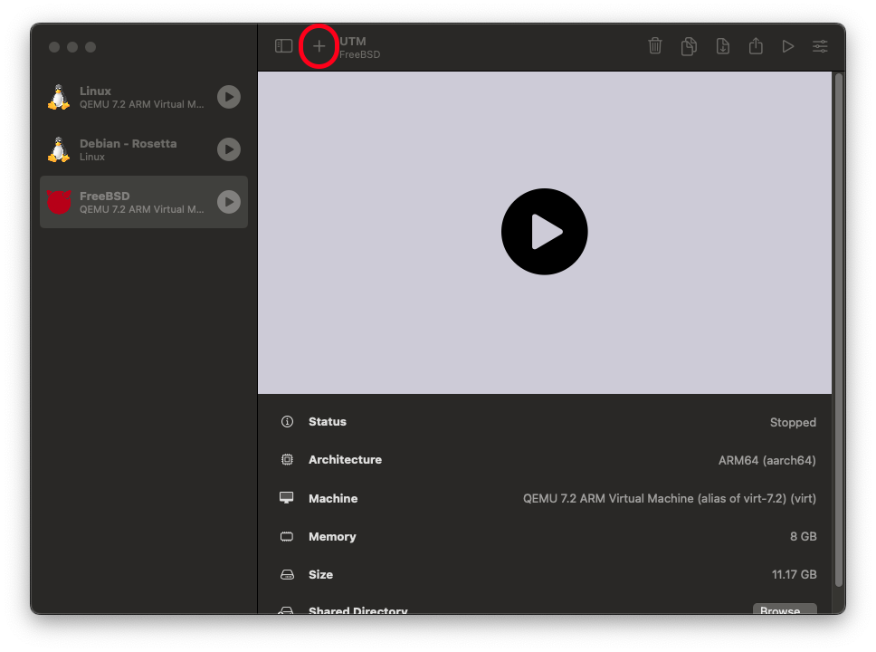
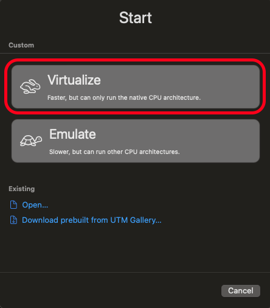
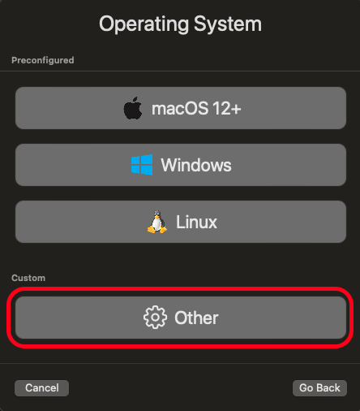
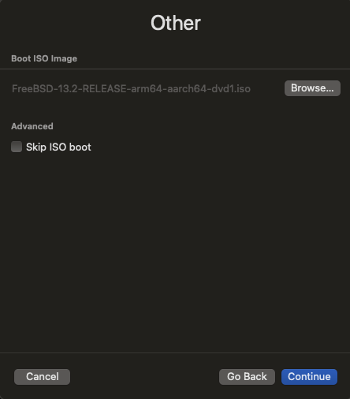
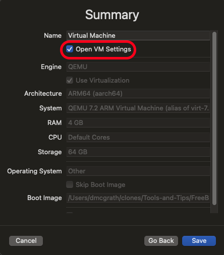
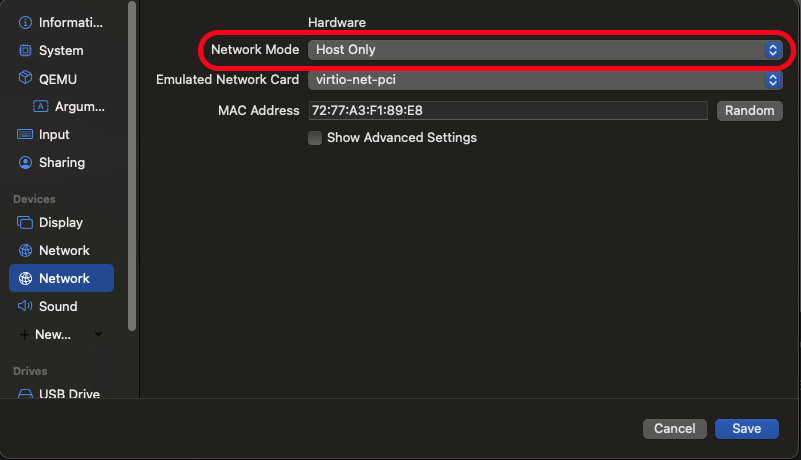

VM Setup on macOS without paying for virtualization software

* auto-gen TOC:
{:toc}

## Common tools

Setting up a VM on macOS is relatively straightforward. While you could spend lots of money to get a commercial hypervisor like Parallels Desktop or VMware Fusion, that's...ridiculous. Sure, they can do some fancy stuff, but we are sticking with open source solutions! Plus, they cost lots of money, and that's just wrong.

So, what can we use? Well, there's the option of VirtualBox if you're on an Intel Mac. But a) that requires you are on an Intel Mac, b) that requires you interact with Oracle, and c) it has been nothing but trouble in my past classes. So, don't use it. Instead, we'll use the [Universal Turing Machine (UTM)](https://github.com/utmapp/UTM/releases) software. It's free, it's open source, and it's pretty easy to use. It's also a Universal app, so it runs on both Intel and Apple Silicon Macs. More importantly, it provides an easy-to-use wrapper around the QEMU hypervisor, which is what we'll be using to run our VMs.

Alternatively, if you're a brew user, you can use

```sh
$ brew install --cask utm
```

to get UTM installed. If you're really feeling like you want to do things "The Linux Way", you can install `libvirt` and `virt-manager` via brew, and use that to manage your VMs. I'm not going to cover that here, but it's an option. 

Or, you can go full masochist and use `qemu` directly. I'm not going to cover that here, either. And if you think it makes sense, why are you here? Go away. Or better yet, talk to me about becoming a TA.

## Running on Intel

If you're using an Intel Mac, you're in luck. You could take the easy road for the virtual network setup. Well, mostly easy. You could use [pfSense](https://www.pfsense.org/) directly, rather than using FreeBSD and then setting up tools yourself. But, that just isn't nearly as much fun. So read the next section and do it that way. Yes, I'm serious. You had to actually learn math before you got to use the calculator, right? Same thing here. And if that wasn't the case for you, just smile, nod, and pretend it was.

## Running on Apple Silicon (M1+)

Alas, you don't get to take the easy road, because for reasons that escape me, Netgate doesn't build ARM versions of pfSense except for their own hardware. And building pfSense for ARM is an exercise in frustration, because they go so far as to tell you to just purchase their hardware when you try. Blah, annoying. But hey, even if we could use pfSense, we aren't going to, because the Intel folks don't get to either.

So, instead of installing pfSense, just install [FreeBSD](https://download.freebsd.org/ftp/releases/ISO-IMAGES/13.2/FreeBSD-13.2-RELEASE-arm64-aarch64-dvd1.iso.xz), which is what pfSense runs on anyway. This is actually better, because we get to run on a more up-to-date platform, and we aren't missing a bunch of useful tools like the pfSense folks. Plus, we get to learn how to do things the hard way, which is always fun, right?

## VM Installation, Step by Step

OK, you have UTM installed, and you're ready to create your VM. How? Time for a little show and tell! Please only use the line appropriate for your architecture.

1. Download your image:

   ```sh
   ❯ curl -LO https://download.freebsd.org/ftp/releases/ISO-IMAGES/13.2/FreeBSD-13.2-RELEASE-arm64-aarch64-dvd1.iso.xz
   ❯ curl -LO https://download.freebsd.org/ftp/releases/ISO-IMAGES/13.2/FreeBSD-13.2-RELEASE-amd64-dvd1.iso.xz
   ```
1. Uncompress your image:

   ```sh
   ❯ xz --decompress --verbose FreeBSD-13.2-RELEASE-arm64-aarch64-dvd1.iso.xz
   ❯ xz --decompress --verbose FreeBSD-13.2-RELEASE-amd64-dvd1.iso.xz
   ```

1. Checksum your image:

   ```sh
   ❯ sha512sum --tag FreeBSD-13.2-RELEASE-arm64-aarch64-dvd1.iso
   SHA512 (FreeBSD-13.2-RELEASE-arm64-aarch64-dvd1.iso) = 21b348e9a38b5bf98995018484af542df84c3a582ccbcfcd09fae16fdf1e77bf2854f4d2386f83cc7f8024c7a7b01aa15bf6b1133875dec2edc8f60a50d95e56
   ❯ sha512sum --tag FreeBSD-13.2-RELEASE-amd64-dvd1.iso
   SHA512 (FreeBSD-13.2-RELEASE-amd64-dvd1.iso) = 7c5473b9bbc5cb235329b8fa17ffb690abbae67fe5e4bb30260baa034501d3f23eba82679a9871af2f42e9600aff7e9e810a0b03005afc24962ed03945171ae1
   ```

    If you don't have `sha512sum` installed, you can use `shasum -a 512` instead, though it's a perl script, so takes a bit longer.

1. Create a new VM in UTM:

   1. We can create a new VM by clicking the `+` button on the top of the UTM window. This one:

      

   1. We want to virtualize, regardless of which underlying architecture we are using.

      

   1. We aren't installing macOS, Windows, or Linux, so select other:

      

   1. Browse to wherever you downloaded the image, and select the ISO that you uncompressed.
    
      

      Click continue.

   1. I would suggest you give your VM at least 4GB of memory, since it's going to be the primary external interface to your work environment for this class. As for the cores, leaving it at `default` is fine, unless you want to limit it to a specific number of cores (at least 2!). Click continue.

   1. For storage, 64GB should be plenty. We can resize later as needed. Click continue.

   1. We won't be using a shared directory, so just click continue.

   1. On the summary page, ensure that "Open VM Settings" is checked. Give your VM a descriptive name -- I called my VM freebsd. Click "Create VM".

      

   1. On the settings window, click on the "New..." button and select "Network".

      

   1. Click on the newly created network device, and change the "Network Mode" to "Host Only". Click Save.

      
   
   1. Start your VM and proceed through the installation of the operating system. Unless you decide otherwise, the defaults work for almost everything. Don't bother to configure `vtnet1` (the second network interface) during the installation. We'll do that later. Make sure `vtnet0` is configured with DHCP, though.
   
Once you have the freeBSD machine up and running, you can use [this script](freebsd_setup.sh) to do most of what we get from pfSense. You didn't think I was actually going to make you do all of that by hand, did you? That's just cruel. And part of what you get to do if you take my network security class. So, you know, you can do it then. But not now. Now, you get to use the script. And you'll be happy about it.

There's one caveat to the above. If you _really_ don't want to use NAT on the VM, you could instead set the networking mode of the first networking device to "Bridged (Advanced)" and bridge it to a physical NIC on your Mac. This is useful in situations where you want the VM to be a networking peer to your host system, but since you likely don't have multiple physical NICs on your laptop, we aren't really going to cover this much in practice. I will be talking about it in class, though.
